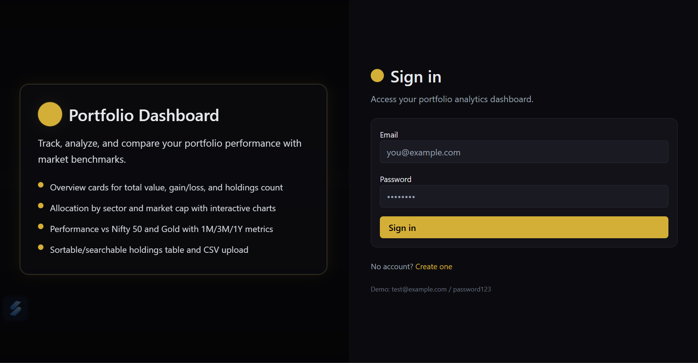
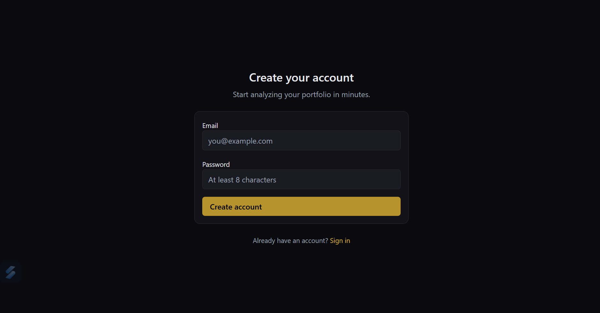
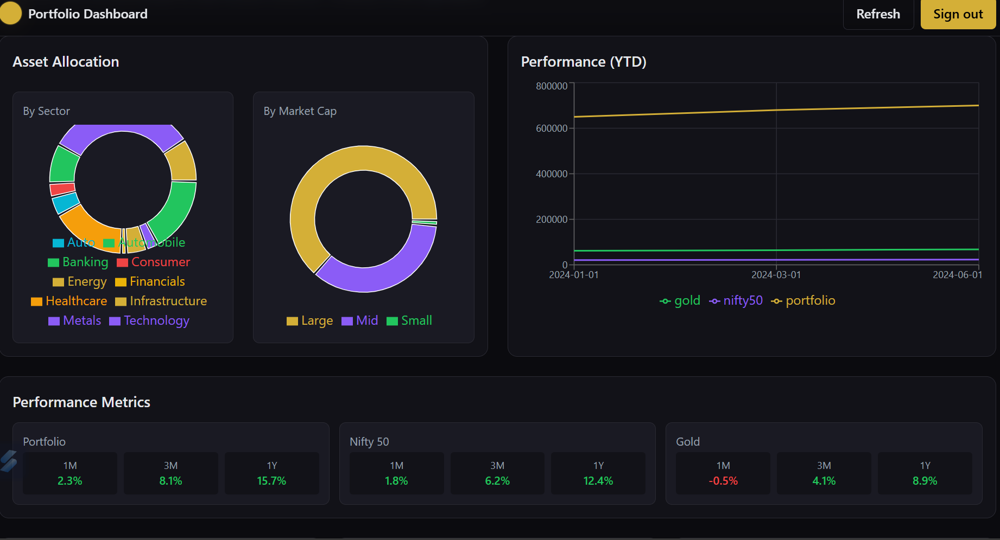

# Portfolio Analytics Dashboard

A clean full-stack monorepo project to build a portfolio analytics dashboard for investors.

---

## 🌟 Features

- 🔐 User Authentication (Register/Login) with JWT  
- 📊 Portfolio data endpoints: holdings, allocation, performance, and summary  
- 📈 Interactive frontend dashboard with charts, sortable and filterable holdings table  
- 💻 Responsive design for mobile, tablet, and desktop  
- 👤 Demo user with seeded realistic Indian stock portfolio data  
- 🧪 Backend unit tests for calculation logic using Jest  

---

## 🚀 Getting Started

### 📦 Prerequisites

- Node.js and npm installed  
- MongoDB database (Atlas or local)  
- API client or browser for testing frontend  

### 📥 Installation

1. Clone the repo:  
   ```bash
   git clone https://github.com/AsifMohd01/Portfolio-Dashboard.git
Backend Setup

bash
Copy
Edit
cd Portfolio-Dashboard/server
npm install
cp .env.example .env
Edit .env file:

ini
Copy
Edit
MONGO_URI=your_mongodb_connection_string
JWT_SECRET=your_jwt_secret
PORT=4000
Seed demo data:

bash
Copy
Edit
npm run seed
Start backend server:

bash
Copy
Edit
npm run dev
Backend runs at: http://localhost:4000

Frontend Setup
Open new terminal and navigate to client folder:

bash
Copy
Edit
cd ../client
npm install
cp .env.example .env
Edit .env file:

ini
Copy
Edit
VITE_API_URL=http://localhost:4000
Start frontend dev server:

bash
Copy
Edit
npm run dev
Frontend runs at: http://localhost:5173

 ---

## 📸 Screenshots

### Login Page  
   

### Register Page 
  

### Dashboard  
  

### Dashboard   
  

---

📚 Project Structure
bash
Copy
Edit
portfolio-analytics-dashboard/
├── server/
│   ├── server.js               # Server entrypoint and DB connection
│   ├── src/
│   │   ├── app.js              # Express app and middleware
│   │   ├── config/db.js        # MongoDB connection
│   │   ├── controllers/        # Auth and portfolio controllers
│   │   ├── middleware/         # Auth and error middleware
│   │   ├── models/             # User and Holding schemas
│   │   ├── routes/             # API routes for auth and portfolio
│   │   └── utils/              # Calculation helpers
│   ├── scripts/seed.js         # Seed demo user and portfolio
│   └── tests/calc.test.js      # Jest unit tests
├── client/
│   ├── src/
│   │   ├── components/         # React UI components (cards, charts, tables)
│   │   ├── pages/              # Login, Register, Dashboard pages
│   │   ├── services/           # API fetch helpers
│   │   └── App.jsx             # Main React app
│   ├── public/
│   └── package.json
└── README.md
🔗 API Documentation
Base URL: /api
Authentication
POST /auth/register
Body: { email, password }
Response: 201 Created with { message }

POST /auth/login
Body: { email, password }
Response: 200 OK with { token } (JWT token)

Protected Portfolio Endpoints (Authorization: Bearer <token>)
GET /portfolio/holdings
Returns user holdings with gain/loss data.

GET /portfolio/allocation
Returns allocation by sector and market cap.

GET /portfolio/performance
Returns portfolio and benchmark historical performance.

GET /portfolio/summary
Returns key metrics and insights about the portfolio.

🧮 Calculation Logic
Holding value = quantity × currentPrice

Invested = quantity × avgPrice

Gain/Loss = value − invested

Gain/Loss % = (gainLoss / invested) × 100 (safe from divide-by-zero)

Allocation sums holding values grouped by sector and market cap, calculating their percentage of total portfolio value

Performance timeline and returns generated synthetically over the last 12 months

🧪 Running Tests
Run backend Jest unit tests:

bash
Copy
Edit
cd server
npm test
🚀 Deployment
Backend: Deploy on Render, Heroku, AWS, etc.

Set env vars: MONGO_URI, JWT_SECRET, PORT

Start command: npm start

Frontend: Deploy on Vercel, Netlify, or similar

Set env var: VITE_API_URL to your backend URL

Build with npm run build

🤖 AI Tools Usage
This project was primarily developed by me. ChatGPT was used occasionally to fix bugs and generate small code snippets.

📞 Contact
For questions or support, contact me:
Email: asifmohd3840@gmail.com
Phone: +91-8491040620